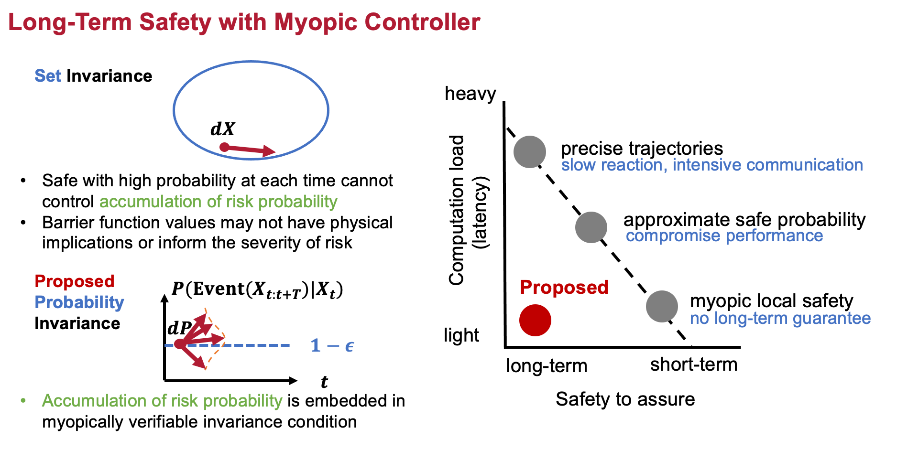
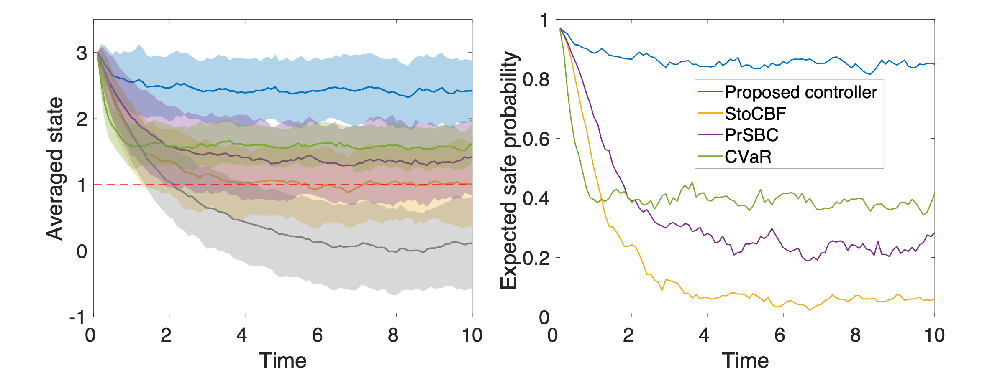

## Myopically Verifiable Probabilistic Certificate for Long-term Safety


## Description

This repository contains an implementation of the paper **“Myopically Verifiable Probabilistic Certificates for Safe Control and Learning”** published in *IEEE Transactions on Automatic Control (TAC)*.

A shorter version of this work, **“Myopically Verifiable Probabilistic Certificates for Long-Term Safety”** appeared at the *2022 American Control Conference (ACC)*.







## How to run

For switching control, run `switching.m`.

For worst case control, run `worst_case.m`.

For nonlinear system setting, run `nonlinear_swiching.m` and `nonlinear_worst_case.m`.

For 3D switching control of a stable system, run `switching_3d.m`.

For path integral importance sampling, run `path_integral.m`.

For CVaR and proposed method ablation experiments, run `cvar_ablation.m` and `proposed_ablation.m`

For probabilistic safety certificate for RL, see [Policy Gradient](https://colab.research.google.com/drive/17tWsnQ4YerIJK1OWMM3z4wpx1uTHeH9a#scrollTo=SLGc9BvZwUFX) and [Q-learning](https://colab.research.google.com/drive/1ts6PVN3c94Q_9xlehk6OWhJEta64Ka4E#scrollTo=Hqb4naXbsfpt) on Google Colab.


## Citation

```biblitex
@article{wang2024myopically,
  title={Myopically verifiable probabilistic certificates for safe control and learning},
  author={Wang, Zhuoyuan and Jing, Haoming and Kurniawan, Christian and Chern, Albert and Nakahira, Yorie},
  journal={arXiv preprint arXiv:2404.16883},
  year={2024}
}

@inproceedings{wang2022myopically,
  title={Myopically verifiable probabilistic certificate for long-term safety},
  author={Wang, Zhuoyuan and Jing, Haoming and Kurniawan, Christian and Chern, Albert and Nakahira, Yorie},
  booktitle={2022 American Control Conference (ACC)},
  pages={4894--4900},
  year={2022},
  organization={IEEE}
}
```

